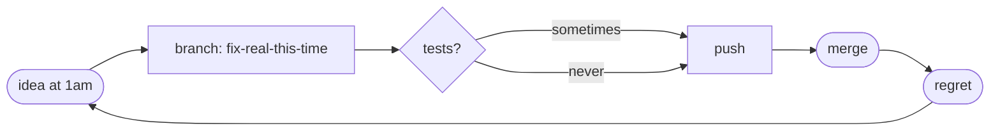

# hadi almarzooq

> writes software at hours that would alarm a doctor.
> mostly works.

- **role** — software engineer @ [thmanyah-llc](https://thmanyah.com)
- **based** — khobar, on paper. nocturnal, in practice.
- **usually available at** — peak: 22:00 → 04:00. cameo: 09:00 → 11:00.
- **how i function?** — coffee. there is no fallback.
- **off-hours** — padel addict. losing, mostly.
- **now** — shipping apps to screens 10ft away

<br clear="all">

---

### what i actually ship

apps for things without keyboards — smart TVs, consoles, set-top boxes, and the streaming UX around them.
admin panels and APIs that feed them, mostly TypeScript.
once shipped a PS5 app. yes, really.
the rest is duct tape and conviction.


---

### this week

```diff
+ a TV UI that runs at 60fps if asked nicely
+ a dashboard, slightly less ugly
+ an API stops shouting in prod
+ a focus state, third time's the charm
- responding before noon, trying wallah
- the gym
- sleep, briefly
```

---

### how a PR ships around here



---

### receipts

| claim | evidence |
|---|---|
| writes code | check the green squares |
| ships it across living rooms | smart TVs, consoles, PS5 |
| breaks things on purpose | ask offline |
| runs on coffee | observable from orbit |

---

[linkedin](https://www.linkedin.com/in/hadi-al-marzooq) • [x](https://x.com/red_hadi)

<sub>reply latency varies by timezone, mood, and how full the cup is.</sub>
